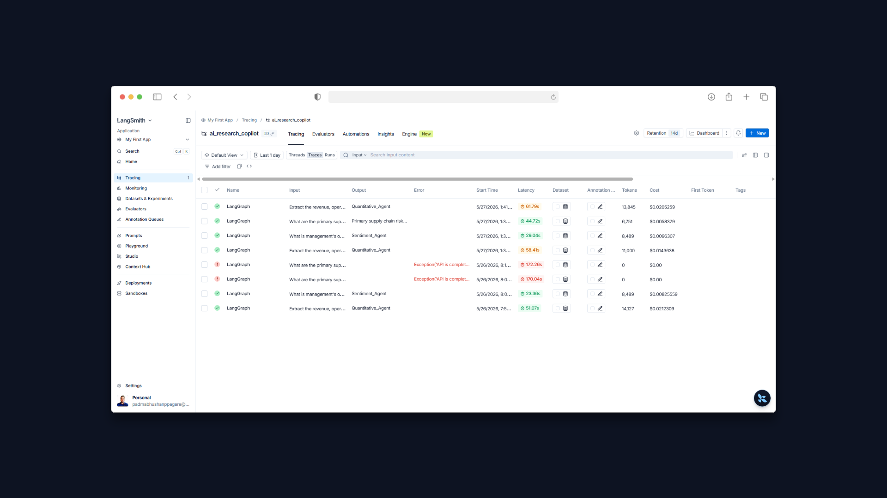

# 📈 Enterprise AI Financial Research Copilot


An institutional-grade, multi-agent Retrieval-Augmented Generation (RAG) system designed to autonomously ingest, analyze, and extract quantitative and qualitative insights from SEC filings (10-K/10-Q). 

This project demonstrates a production-ready cognitive architecture featuring **deterministic routing, local vector storage, structured data extraction, and self-correcting hallucination loops.**

## 🧠 Cognitive Architecture

The system utilizes a **LangGraph Orchestrator** to route complex financial queries to specialized AI agents based on intent.

* **👔 Supervisor Agent (The Router):** Evaluates user intent and deterministically routes the query to the appropriate specialist agent. Includes built-in API rate-limit resilience and exponential backoff.
* **🧮 Quantitative Agent:** Bypasses LLM math hallucination by forcing the LLM to extract raw data into a strict `Pydantic` schema, which is then passed to a pure `Pandas` engine to calculate margins, YoY growth, and render dynamic UI charts.
* **🕵️‍♂️ Research Agent (Nested Graph):** A fully autonomous LangGraph sub-routine that executes a Retrieve-Grade-Generate loop. It features a strict hallucination "kill-switch" that forces the model to rewrite answers if they are not mathematically grounded in the retrieved SEC context.
* **🗣️ Sentiment Agent:** Analyzes management tone, forward-looking statements, and confidence levels regarding macroeconomic headwinds and strategic acquisitions.

## 🔒 Security & Data Governance

To align with strict financial data governance standards, this architecture utilizes a **Hybrid-Compute RAG Pipeline**:
* **Memory / Embeddings:** 100% Local and Offline. Utilizes HuggingFace `all-MiniLM-L6-v2` (384 dimensions) and ChromaDB to ensure proprietary financial documents never leave the local environment during the embedding phase.
* **Reasoning:** Google Gemini 2.5 Flash for high-speed, cost-effective structured reasoning and schema extraction.

## 📊 Telemetry & Observability

Full execution tracing is integrated via **LangSmith** to provide a complete audit trail of the AI's reasoning process.

> 
*Caption: LangSmith trace demonstrating successful intent routing, token consumption tracking, and latency monitoring.*

## 🚀 Key Features

* **Dynamic UI Rendering:** The Streamlit frontend automatically adapts to the agent's output, rendering Markdown text, Sentiment Reports, or interactive Pandas DataFrames and Line Charts based on the routed intent.
* **Batch Document Grading:** Optimized document relevance grading to minimize API calls and prevent context bloat.
* **Graceful Degradation:** If the Quant Agent cannot find sufficient data to populate the Pandas matrix, it safely falls back to a natural language response rather than hallucinating numbers.

## 🛠️ Installation & Usage

**1. Clone the repository and install dependencies:**
```bash
git clone [https://github.com/YourUsername/ai_research_copilot.git](https://github.com/YourUsername/ai_research_copilot.git)
cd ai_research_copilot
pip install -r requirements.txt